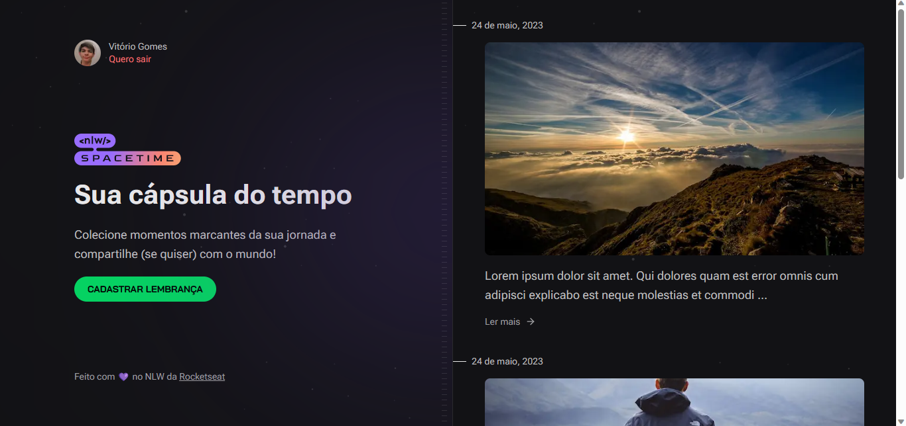
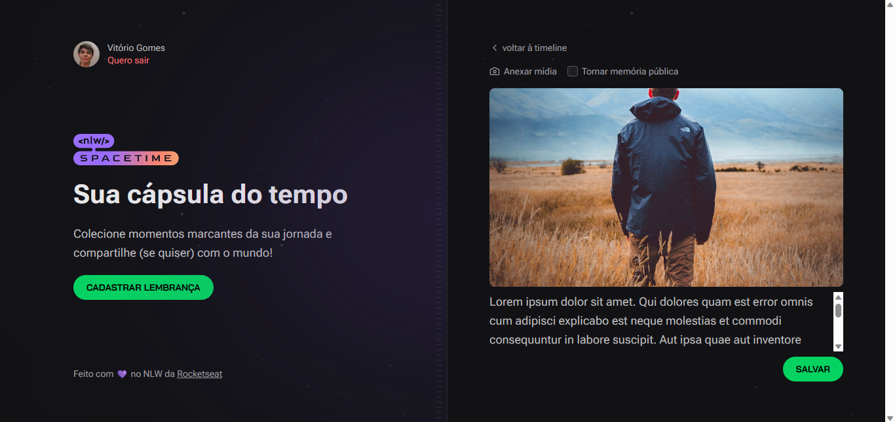

# Cápsula do Tempo
Cápsula do Tempo. Colecione momentos marcantes da sua jornada e compartilhe (se quiser) com o mundo!

Depois de criar sua conta utilizando o Github é possível criar uma lembrança onde estará salva no seu feed. O login do usuário é persistido através de um JWT gerado pelo back-end e armazenda em um cookie. Aplicação desenvolvida durante o NLW Spacetime da Rocketseat.




## ✨ Tecnologias
### Front-end
- Next.js | TypeScript | TailwindCSS | axios | lucid-react | js-cookie | jwt
### Back-end
- TypeScript | Fastify | Prisma | axios | zod

## 🔖 Layout
Você pode visualizar o layout do projeto através [desse link](https://www.figma.com/file/NflWj5JZkl2twSYo0cxiqh/C%C3%A1psula-do-tempo-%E2%80%A2-Trilha-Ignite-(Community)?type=design&node-id=205%3A3&t=Omj9DZ1At9WC0nAF-1).

## 💻 Uso
Em seu terminal:
```bash
# Clone o repositório
git clone https://github.com/ViGF/nlw-spacetime.git
# Acesse a pasta back-end do projeto
cd nlw-spacetime/server
# Instale as dependências
npm i
# Execute a aplicação
npm run dev
```
```bash
# Em outra janela do seu terminal acesse a pasta do front-end do projeto
cd nlw-spacetime/web
# Instale as dependências
npm i
# Execute a aplicação
npm run dev
# Agora basta acessa-la
```

## 🚀 Features para você implementar
- Compartilhamento público da memória através de link
- Apagar e editar memória
